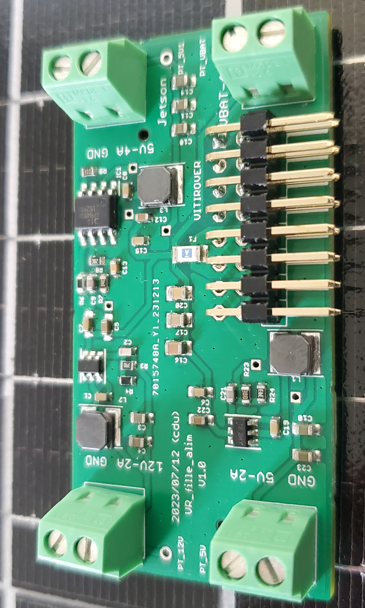
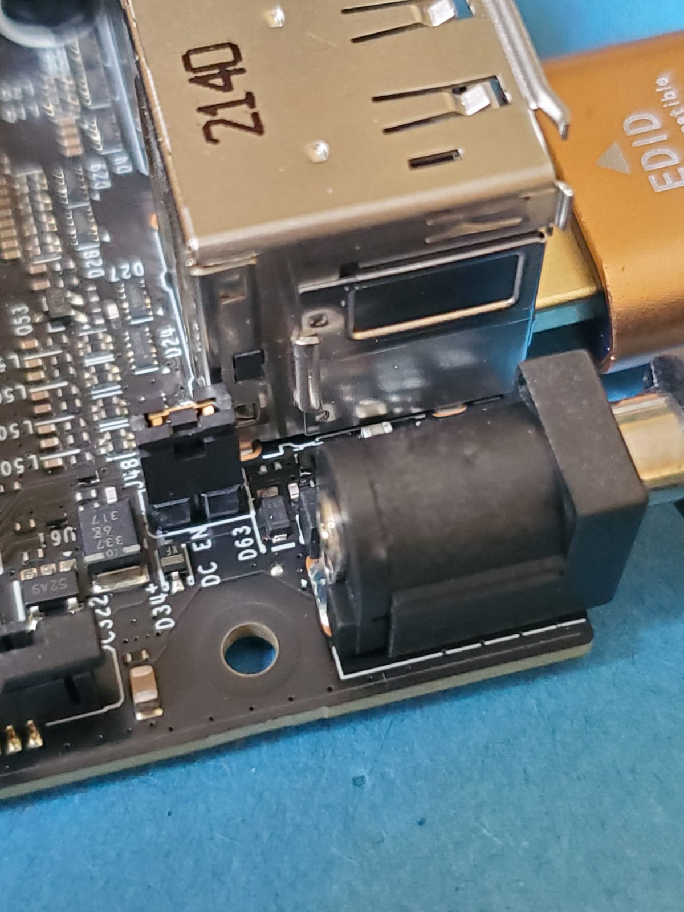

## Power Board Overview 🌐

The power board features four terminal blocks, each providing a different maximum output voltage and current. Here are the specifications and maximum power calculations for each:

- **12V, 2A**  
  Maximum Power: `24W`
- **5V, 2A**  
  Maximum Power: `10W`
- **5V, 4A** (dedicated for powering the Jetson Nano, see above)  
  Maximum Power: `20W`
- **Battery Voltage (24V nominal), 6A**  
  Maximum Power: `144W`

Additionally, links to the EAGLE files for the power board are provided. These files include all necessary schematics and board designs in EAGLE format, ideal for modification or further development.

### Jetson Nano DC Power Jumper

As explained (but difficult to find) in the [Jetson Nano Developper Kit User Guide](https://developer.download.nvidia.com/assets/embedded/secure/jetson/Nano/docs/NV_Jetson_Nano_Developer_Kit_User_Guide.pdf?onc0KLg5WqXnycWsVxITqVJuQhOv7dOwZDn_6wMDd2yiHHP-d7uv_KwyZQFvdmQjeIwzmvuDMyNS2j6b7665m7rmn-Uv2NYOiBAWWCoRhCM5Xq7rqr0AOUHEIOBn2JpZgTdjgMTqyD2t5OOGEKS2ve_BtuEa8IP3TMF1NwbBa36ZujDmUTJMczagMmcFHalibv8=&t=eyJscyI6ImdzZW8iLCJsc2QiOiJodHRwczovL3d3dy5nb29nbGUuY29tLyJ9) and [on the jetson forum](https://forums.developer.nvidia.com/t/power-supply-considerations-for-jetson-nano-developer-kit/71637), for versions of the Jetson Nano with a Barrel Jack, you have to **connect the jumper** to the J48 pins to be able to power the board from this power supply. We connect it to ensure that everything is working before shipping the robot to you.
Similarly, if you want to power the Jetson from another power source, you have to **disconnect** the jumper.

### Safety Warning ⚠️

**Current Limitation:** The total current consumption across all systems connected to the board must not exceed 6A. Exceeding this limit will trigger a protective fuse, rendering the power board unusable.

**Connection Precautions:** It is crucial to follow the markings on the PCB. Ensure that the positive and negative terminals (GND) are not reversed when connecting any system to the terminal blocks.

